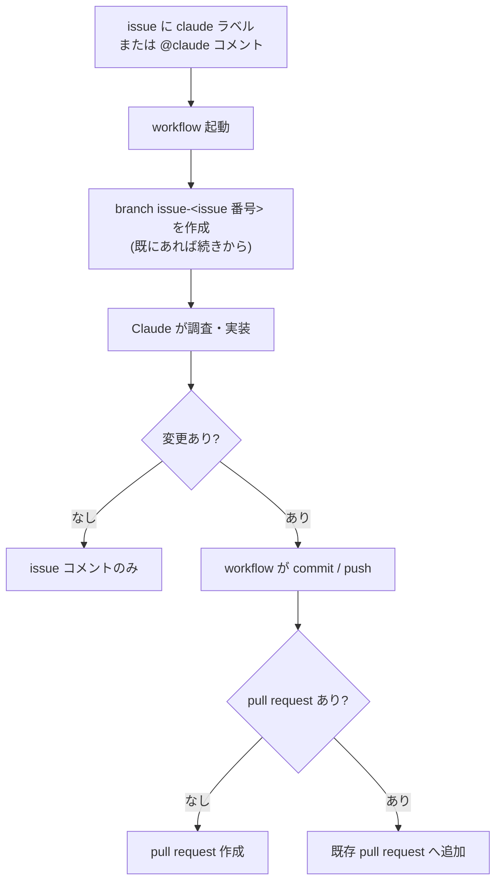

# CLAUDE.md

このリポジトリで Claude Code が作業するときの前提とルールをまとめる。
issue に `claude` ラベルを付けると Claude が自動で起動するため、Claude 自身がこのファイルを読んで
「どの branch で作業し、何を成果物として残すか」を判断できる状態にしておくことを目的とする。

## 目次

- [1. リポジトリの構成](#1-リポジトリの構成)
- [2. issue 起点の自動実行フロー](#2-issue-起点の自動実行フロー)
- [3. issue 起動時に Claude が守るルール](#3-issue-起動時に-claude-が守るルール)
  - [3.1 push と pull request 作成は workflow に任せる](#31-push-と-pull-request-作成は-workflow-に任せる)
  - [3.2 commit message の草案を書き出す](#32-commit-message-の草案を書き出す)
  - [3.3 pull request 本文の草案を書き出す](#33-pull-request-本文の草案を書き出す)
  - [3.4 issue へ報告する](#34-issue-へ報告する)
- [4. コードを書くときの約束](#4-コードを書くときの約束)

## 1. リポジトリの構成

どこに手を入れるべきかを判断するために、まず全体像を示す。

| パス | 役割 |
| --- | --- |
| `src/generate_survey.py` | VLA 関連ニュースの週次ダイジェストを生成する script |
| `surveys/YYYY-MM-DD.md` | 生成されたダイジェスト。自動生成物なので手で編集しない |
| `.github/workflows/weekly_survey.yml` | ダイジェストを定期生成し default branch へ直接 push する workflow |
| `.github/workflows/claude-issue.yml` | issue を起点に Claude を起動する workflow |

## 2. issue 起点の自動実行フロー

Claude が「自分がどの段階にいるか」を把握できるよう、起動から pull request 作成までの流れを示す。

同じ issue への再起動 (追加コメントなど) では、同じ `issue-<issue 番号>` branch の続きから作業する。
pull request が既に open なら新規作成せず、その pull request に commit が積まれる。

## 3. issue 起動時に Claude が守るルール

workflow と Claude の役割分担を固定しておかないと、二重 commit や default branch への直接 push が起きる。
以下は Claude 側の担当範囲を定めるルールである。

### 3.1 push と pull request 作成は workflow に任せる

branch 作成・commit・push・pull request 作成はすべて `claude-issue.yml` が行う。
Claude は作業ディレクトリのファイルを編集するだけでよく、`git push` や `gh pr create` を実行しない
(`.claude/settings.json` でこれらの Bash 実行を禁止している)。
結果として、default branch へ直接 push される事故が起きず、変更は必ず pull request 経由でレビューされる。

### 3.2 commit message の草案を書き出す

commit message は Claude が最も適切に書けるため、workflow は環境変数 `COMMIT_MESSAGE_FILE` が指すファイルを読む。
ファイルを作らなかった場合は `issue #<番号> への対応` という既定文面になる。

- 1 行目: 72 文字以内の要約。これが pull request の title としても使われる
- 3 行目以降: 変更の理由を書く。何を変えたかは diff から分かるため、なぜ変えたかを優先する

### 3.3 pull request 本文の草案を書き出す

レビュアーが最初に知りたいのは「何が変わり、どこを確認すべきか」である。
環境変数 `PR_BODY_FILE` が指すファイルに Markdown で以下を書く。issue への参照行は workflow が追記する。

- **変更内容**: 何を、なぜ変えたか
- **検証したこと**: 実行したコマンドとその結果。未検証なら「未検証」と明記する
- **人に判断してほしい点**: 判断を委ねたい設計上の選択、リスク、未対応で残した範囲

### 3.4 issue へ報告する

調査結果・質問・判断の依頼といったコード変更以外の連絡は、`gh issue comment` で issue に投稿する。
標準出力に書くだけでは workflow のログに埋もれて読まれないため、必ず issue コメントを残す。

## 4. コードを書くときの約束

レビューの往復を減らすため、既存コードと同じ書き方に揃える。

- コメント・ドキュメント・issue コメントは日本語で書く
- Python は `src/generate_survey.py` に合わせる (type annotation を付け、docstring は numpy style)
- `surveys/` 配下は自動生成物なので、issue で明示的に依頼されない限り編集しない
- 秘密情報 (token など) をファイルや issue コメントに書き出さない
